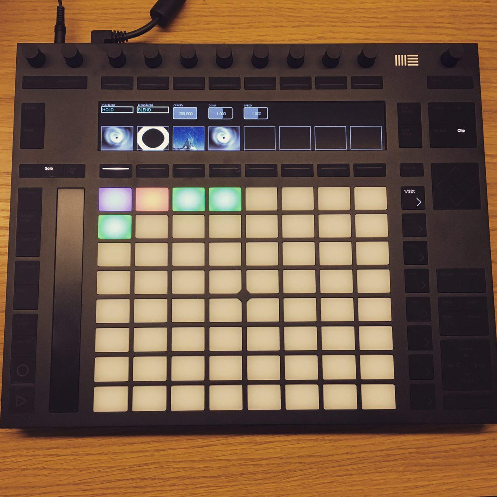

# Visual Push

*[Visual Push Demo](https://vimeo.com/184319266)*

Visual Push is a video sampler which connects to the Ableton Push 2 device.

## Idea
With the software Visual Push, we tried to solve two problems we are facing as visual artist on every live event.

First, there is not the visual midi controller. There are a lot of music midi controllers which are directly connected to a software. For example NI with Traktor is doing a good job there.

As a visual artist you have to buy a music controller which is not directly mapped to your software. This gives you a lot of freedom, but you still have a lot of work to connect the controller to your software. And there are a lot of visual software’s which do not really have good midi or OSC support. And getting a clip preview or something more enhanced is nearly impossible.

Second, there are video generator, projection mapping software and also player out there, but only a few of them do target the real live performance for visual artist. We would like to play with our visuals as we would do with an instrument.

So our idea was to create a new software for live visual performers which directly connects to a midi controller and integrates seamlessly into our current visual setup. As a controller we decided to take the new Ableton Push 2 device, because it is nicely built and has a great 960×160 pixel screen.

With the screen of the Push we are able to create a software and hardware solution which does not really need an open laptop nearby. All the necessary information are displayed on the screen. All visuals are directly configurable over the device and they always show a preview image of them.

Currently we are still developing and testing the software. If you would like to contribute ideas or implement your own features, feel free and join us on github!

## Screenshot

## Links

* [Project Description](https://bildspur.ch/portfolio/items/visual-push/)
* [Demo Video](https://vimeo.com/184319266)

## About
*Developed by Florian 2016*
